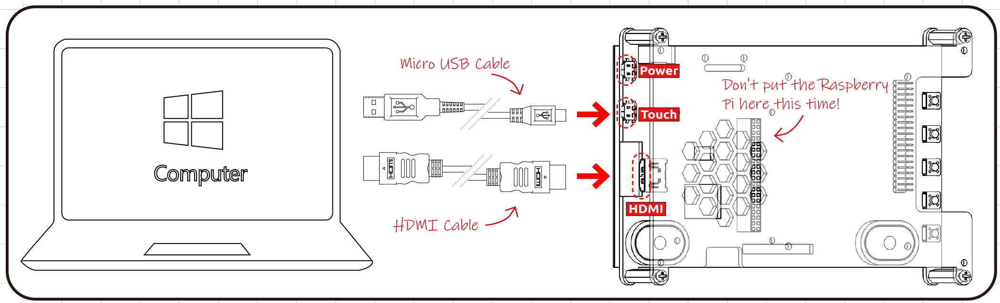
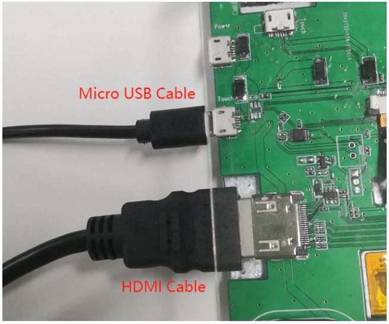
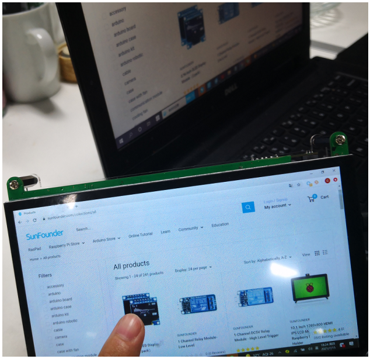

Using as Extension Screen for PC
===================================

If you want to use this screen as an extended Touch Screen for your PC, then you need to connect this Touch Screen to your PC with a Micro USB cable and a HDMI cable. Some computers do not have enough power supply and it is recommended to plug in extra power to the touch screen.

