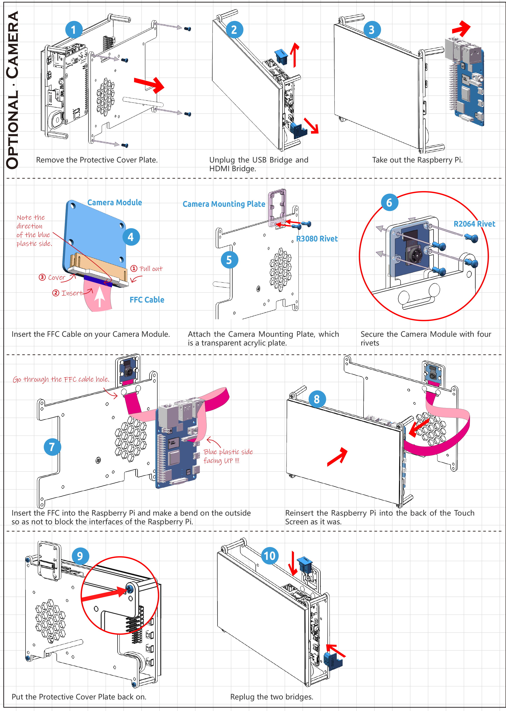

.. _camera_module:

Assemble and Use a Camera Module
=============================================

**Required Components**

* TS-7 Pro Screen
* Camera Module (Self-provided)
* Raspberry Pi (Self-provided)

Hole size for mounting the Camera module:

**Mount Camera Module**

Refer to the following tutorial to mount the camera module.

**Enable the Camera**

Open **Raspberry Pi Configuration**.

.. image:: img/raspbian1.png
  :width: 550
  :align: center

In the **Interfaces** option, **Enable** the Camera, and then click **OK**.

.. image:: img/raspbian2.png
  :width: 500
  :align: center

In the pop-up prompt box, choose to restart now.

.. image:: img/raspbian3.png
  :width: 400
  :align: center

After the restart is complete, use the following command line to check whether the camera is available.

If the camera screen appears it means that the camera is installed successfully. Otherwise the FFC cable needs to be unplugged and plugged in again.

.. raw:: html

    <run></run>

.. code-block:: shell

    raspivid -o vid.h264

