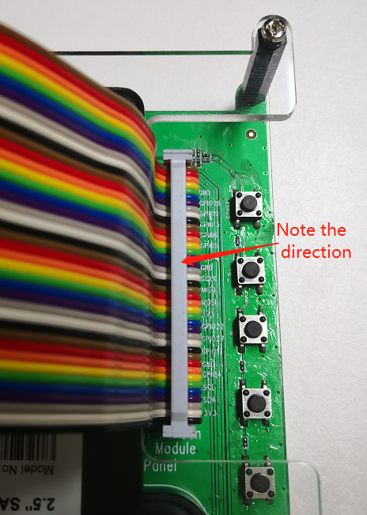
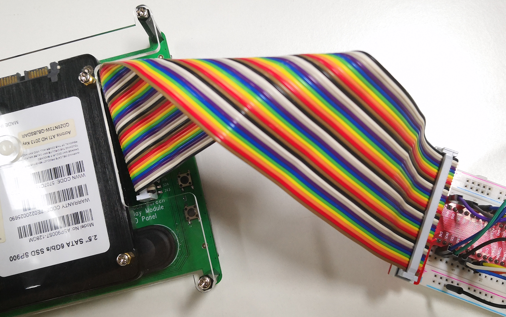

.. _gpio_board:

Extend GPIO to Breadboard
========================================

This screen also retains the 40pin interface of the Raspberry Pi, which can be used for projects. You need to pay attention to the inserting direction of the 40pin cable to avoid burning the Raspberry Pi.

    
