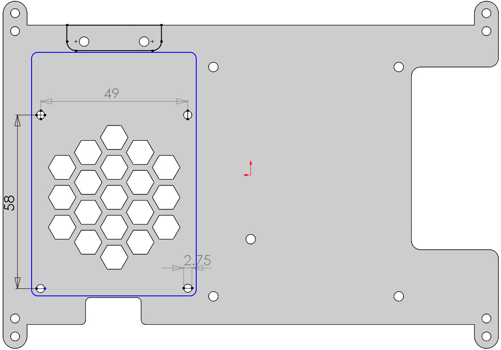

Powered by PiPower
====================

**Required Components**

* TS7-Pro Screen
* `PiPower <https://www.amazon.com/dp/B09QKJTQKJ?ref=myi_title_dp>`_ + 2 18650 batteries (self-provided)
* Raspberry Pi (Self-provided)

Hole size for mounting the PiPower:

**Mount the PiPower**

If you buy our `PiPower <https://www.amazon.com/dp/B09QKJTQKJ?ref=myi_title_dp>`_, you can use it to power the TS7-Pro screen directly, so you can easily get it for outdoor use. 
The specific installation tutorial is as follows.

#. Remove the Protective Cover Plate.

    .. image:: img/power1.jpg

#. Secure the `PiPower <https://www.amazon.com/dp/B09QKJTQKJ?ref=myi_title_dp>`_ to the Protective Cover Plate. Note that the M2.5x6mm screws in the `PiPower <https://www.amazon.com/dp/B09QKJTQKJ?ref=myi_title_dp>`_ are required here.

    .. image:: img/power2.jpg

#. Put the Protective Cover Plate back on.

    .. image:: img/power3.jpg

#. Connect the `PiPower <https://www.amazon.com/dp/B09QKJTQKJ?ref=myi_title_dp>`_ to the Raspberry Pi with a USB cable.

    .. image:: img/power4.jpg

#. Turning the `PiPower <https://www.amazon.com/dp/B09QKJTQKJ?ref=myi_title_dp>`_ switch to ON will allow the Raspberry Pi to boot up.

    .. image:: img/power6.jpg
