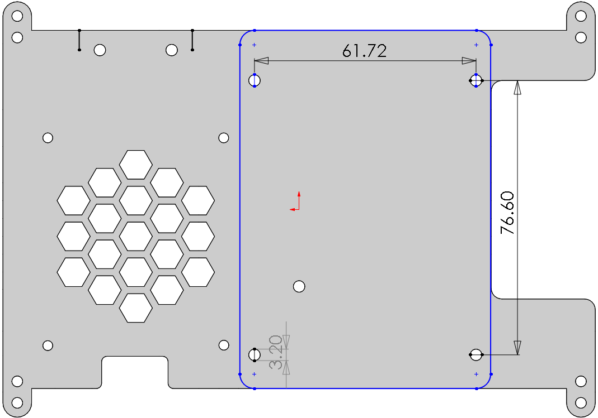
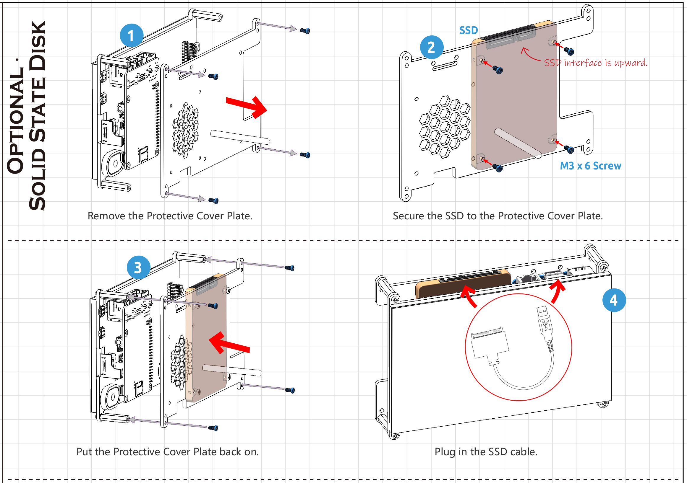

Mount the Hard Disk
=====================

**Required Components**

* TS-7 Pro Screen
* 2.5" Hard Disk (Self-provided)
* Raspberry Pi 4(Self-provided)

Hole size for mounting the hard disk:

**Assemble the Hard Disk**

Follow the tutorial below to mount the Hard Disk on the TS-7 Pro Screen.

**Booting RPi from Hard Disk**

To boot Raspberry Pi with Hard Disk, you need to update the Bootloader of Raspberry Pi, then install Raspberry Pi OS on Hard Disk, and finally reboot Raspberry Pi and Hard Disk.

You have 2 methods.

**Using Raspberry Pi Imager**: This method is recommended for newbies, it is easy to operate and less error-prone. But this method will make you lose the contents of your Micro SD card.

**Using Commands**: For users with basic knowledge, you can use this method if you don't want to lose the data of your Micro SD card.

* **Using Raspberry Pi Imager**

#. Download `Raspberry Pi Imager <https://www.raspberrypi.com/software/>`_.

#. Select a spare SD card (the data will be erased), then insert it into your computer using the reader.

#. Launch Raspberry Pi Imager and click **CHOOSE OS**.

    .. image:: img/ssd1.png

#. Scroll to the bottom of the page and select **Misc utility images**.

    .. image:: img/ssd2.png

#. Select **Bootloader**.

    .. image:: img/ssd3.png

#. Select a boot-mode, **SD card boot** is recommended.

    .. image:: img/ssd4.png

#. Select SD card and then Write, you will be prompted that all data on this Micro SD card will be erased, so it is recommended to select a spare SD card.

    .. image:: img/ssd5.png

#. Once the following message appears, you can unplug the card reader from the computer.

    .. image:: img/ssd6.png

#. The green activity LED will blink with a steady pattern and the screen will be green on success.

    .. image:: img/ssd10.jpg

#. Power off the Raspberry Pi and remove the Micro SD card.

#. Now to install the Raspberry Pi OS on your hard disk. Connect your hard disk to your computer with the cable that came with the drive.

    .. image:: img/ssd7.jpg

#. Open the Raspberry Pi Imager, click **CHOOSE OS** -> **Raspberry Pi OS(other)** -> **Raspberry Pi OS(Legacy)**.

    .. note::

        Of course you can also choose the latest version of Raspberry Pi OS (Debian Bullseye), but **Debian Bullseye** version will cause some features to not work, so it is recommended to continue using the **Debian Buster** version.

    .. image:: img/ssd9.png

#. After installation, unplug your hard disk and plug it into the USB port of the Raspberry Pi. Now power up the Raspberry Pi and you will see the Raspberry Pi desktop.

    .. image:: img/ssd8.png

* **Using Commands**

#. Run the following commands to update Raspberry Pi OS to get the latest version of the **rpi-eeprom** package.

    .. raw:: html

        <run></run>

    .. code-block:: shell

        sudo apt update
        sudo apt full-upgrade

#. Run following command to open the **Raspberry Pi Software Configuration Tool**.

    .. raw:: html

        <run></run>

    .. code-block:: shell

        sudo raspi-config

#. Select **Advanced Options** -> **Bootloader Version**

    .. image:: img/ssd12.png

#. Select Default for factory default settings or Latest for the latest stable bootloader release. 
    .. image:: img/ssd11.png

#. After rebooting the Raspberry Pi, use the following command to view the name of the storage device.

    .. raw:: html

        <run></run>

    .. code-block:: shell

        sudo fdisk -l

#. Now, clone the system from the Micro SD card. Where ``if`` is followed by the sd card name and ``of`` is followed by the SSD hard drive name.

    .. raw:: html

        <run></run>

    .. code-block:: shell

        sudo dd if=/dev/mmcblk0 of=/dev/sda bs=4M

#. After the copy，power off the Raspberry Pi and remove the Micro SD card. 
#. Now power up the Raspberry Pi again and you will see the Raspberry Pi desktop.

    .. image:: img/ssd8.png

You can refer to the official Raspberry Pi tutorial at:

https://www.raspberrypi.com/documentation/computers/raspberry-pi.html#updating-the-bootloader

