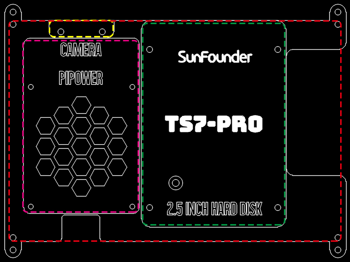

HARDWARE INTRODUCTION
===============================

**Features**

* Screen Size: 7 inch Display
* Resolution: 1024×600 Pixels
* Working Voltage: DC 5V
* Rated Power: 3.5W
* Touch Screen: 5 dot touch control applies to it, plug and play.
* Refresh rate: 60Hz
* External Dimensions: 165×114×40mm (Excluding the height of the metal support(55mm))
* Visual Area: 154.21(H)×85.92(V)
* Panel Type IPS: 45% color gamut
* HD full view screen
* Response Time: 5ms
* Contrast Ratio: 800:1
* Visual Angle: 170°
* Display Color: 262K
* Brightness: 300cd/m2
* Input Signal: HDMI
* HDMI Input: Adjustable resolution ranging 640×480 ~1920×1200
* Speaker: 8Ω/2W

**Interfaces Introduction**

* Power
    Used to provide power to this screen when you use it as an extended screen.

* Touch(External)
    When you use this screen as an external screen, you can connect this screen to your device with a micro USB cable. If the screen does not have enough power, you can connect a separate Micro USB cable to the Power port.

* HDMI
    HDMI connector

* Speaker
    This screen has 2 speakers for playing sound, music, etc.

* Touch(Raspberry Pi)
    When you drive this display with Raspberry Pi, you need to connect this port to your Raspberry Pi with the USB Bridge to get the touch function.

* 40 Pin Female Header
    You can plug in your Raspberry Pi here.

* 40 Pin Male Header
    This is the 40 pin header from the Raspberry Pi, you can use it to do some projects or use a 40pin ribbon cable expand it to the breadboard.

* Buttons
    These 5 buttons can be used to turn on/off the screen, adjust the volume and brightness, they are used in combination, see the table below for details.

    The first row refers to Working, Sleep, Menu, Volume Adjust and Brightness Ajust, 5 states; the first column refers to the 5 buttons. If in Working state, press the Power button can enter Sleep state; press the Menu button can enter Menu; press the "+" button to increase the volume; press the "-" button to decrease the volume; press the Back button can enter Brightness Ajust interface.

.. list-table:: 
    :header-rows: 1

    * - 
      - Working
      - Sleep
      - Menu
      - Volume Adjust
      - Brightness Adjust
    * - Power
      - Enter Sleep state
      - Enter Working state
      - Enter Sleep state
      - Enter Sleep state
      - Enter Sleep state
    * - Menu
      - Open the Menu
      - 
      - Confirm
      -
      -
    * - "+"
      - Increase Volume
      -
      - "+"
      - Increase Volume
      - Increase Brightness
    * - "-"
      - Decrease Volume
      -
      - "-"
      - Decrease Volume
      - Decrease Brightness
    * - Back
      - Open the Brightness adjust
      -
      - back
      - back
      - back

**Acrylic Case**

* Red box: Holes used to hang the wall.
* Purple box: Holes used to install Pipower
* Yellow box: Holes used to mount camera
* Green box: Holes for mounting SSD.

