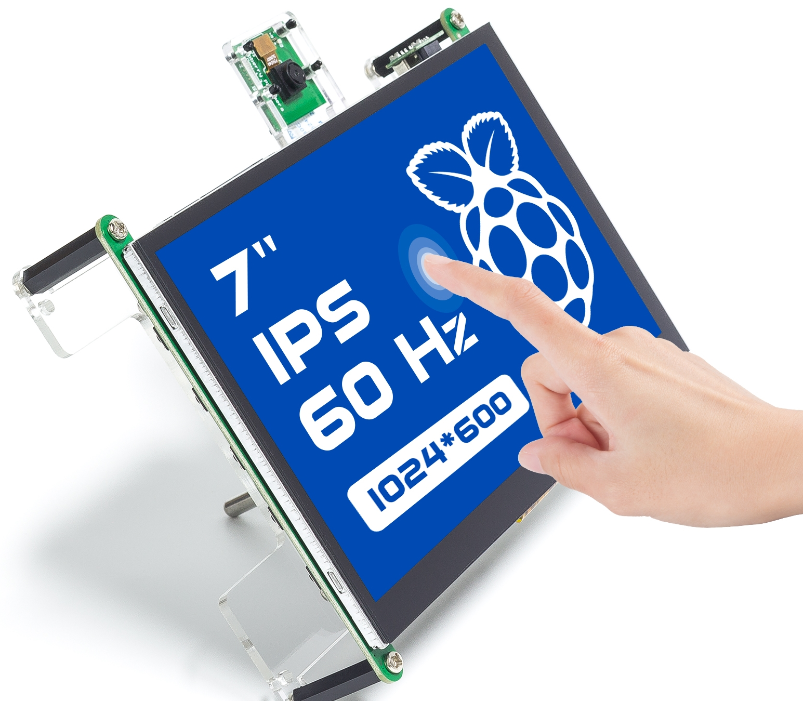

TS7-Pro 7-inch Touch Screen
===============================

**Introduction**

This is a 7-inch touch screen with dual-channel speakers and protective cover and stand. High definition display with comfortable viewing angle and good handheld experience.

The onboard buttons can be used to adjust the volume and brightness, as well as turn on/off the screen.

Reserved hard drive mounting position, compatible with 2.5-inch mechanical hard disk and solid state drive. If you use SSD instead of Micro SD card, it can increase the capacity of Raspberry Pi as well as improve the operation speed.

The 40pin interface is also reserved, so you can connect 40pin cable or connect sensors directly to ensure the scalability of Raspberry Pi.

Ideal for applications like retro gaming, industrial control, as a secondary monitor, in home automation, for 3D printing control, and as a |link-pc-monitor|.

If you encounter problems in using the process, or any suggestions, please feel free to send Email and we will reply as soon as possible.

Here is the Email: cs@sunfounder.com.

**About the display language**

In addition to English, we are working on other languages for this course. Please contact service@sunfounder.com if you are interested in helping, and we will give you a free product in return. 
In the meantime, we recommend using Google Translate to convert English to the language you want to see.

The steps are as follows.

* In this course page, right-click and select **Translate to xx**. If the current language is not what you want, you can change it later.

.. image:: img/translate1.png
    :align: center

* There will be a language popup in the upper right corner. Click on the menu button to **choose another language**.

.. image:: img/translate2.png
    :align: center

* Select the language from the inverted triangle box, and then click **Done**.

.. image:: img/translate3.png
    :align: center

.. toctree::
    :maxdepth: 2
    
    hardware_introduction
    component_list_and_assembly_instructions
    quick_guide/quick_user_guide
    extension/adding_peripherals
    project_activities/projects_and_activities
    appendix/appendix
    faq

Copyright Notice
--------------------------

All contents including but not limited to texts, images, and code in this manual are owned by the SunFounder Company. You should only use it for personal study,investigation, enjoyment, or other non-commercial or nonprofit purposes, under therelated regulations and copyrights laws, without infringing the legal rights of the author and relevant right holders. For any individual or organization that uses these for commercial profit without permission, the Company reserves the right to take legal action.

