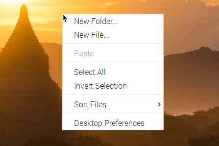

Right Click on Raspberry Pi
=================================

The touchscreen makes it easy to perform simple navigation tasks with your finger or stylus, but you may want to be able to use the context menu (right-click menu).

Then you will need to download a ``Touchégg``. Enter the following command to install it.

**For 32-bit OS:**

.. raw:: html

    <run></run>

.. code-block:: shell

    wget https://github.com/JoseExposito/touchegg/releases/download/2.0.14/touchegg_2.0.14_armhf.deb
    sudo apt install ./touchegg_2.0.14_armhf.deb

**For 64-bit OS:**

.. raw:: html 

    <run></run>

.. code-block:: shell

    wget https://github.com/JoseExposito/touchegg/releases/download/2.0.14/touchegg_2.0.14_arm64.deb
    sudo apt install ./touchegg_2.0.14_arm64.deb

After restarting, you can double-tap the screen to bring up the context menu.

.. raw:: html

    <run></run>

.. code-block:: shell

    sudo reboot

.. note::
    The product is not compatible with some of `Touchégg's <https://github.com/JoseExposito/touchegg>`_ gestures, such as three-finger zoom in/out.
